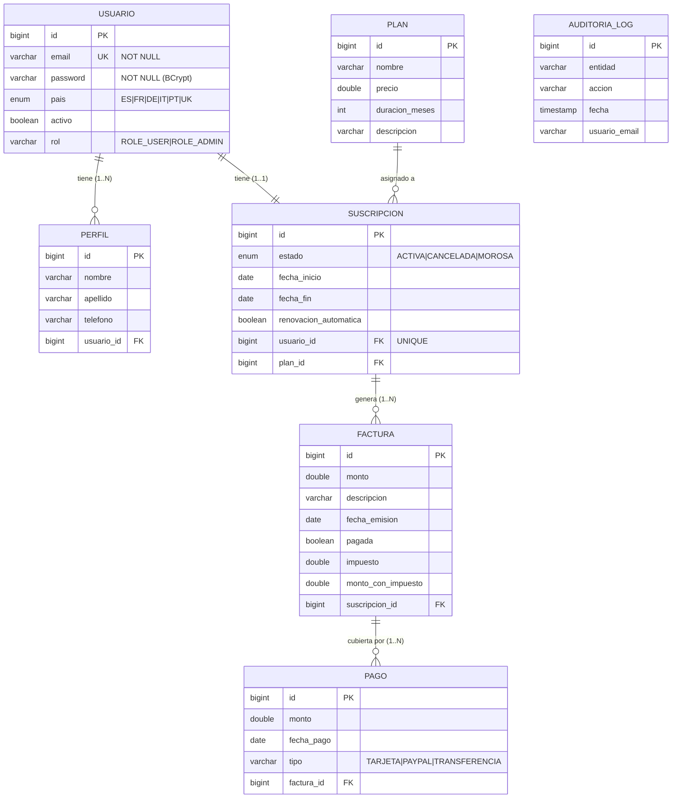

# 🏢 Sistema de Gestión de Suscripciones

> Aplicación web construida con **Spring Boot 4**, **Thymeleaf**, **Spring Security**, **JPA/Hibernate** y **MySQL**.  
> Gestiona usuarios, suscripciones a planes, facturación con impuestos por país y registro de pagos.

---

## 📑 Tabla de Contenidos

1. [Descripción del Proyecto](#descripción-del-proyecto)
2. [Tecnologías Utilizadas](#tecnologías-utilizadas)
3. [Arquitectura del Sistema](#arquitectura-del-sistema)
4. [Diagrama Entidad-Relación](#diagrama-entidad-relación)
5. [Instalación y Configuración](#instalación-y-configuración)
6. [Ejecutar la Aplicación](#ejecutar-la-aplicación)
7. [Módulos del Sistema](#módulos-del-sistema)
8. [Seguridad y Roles](#seguridad-y-roles)
9. [Cálculo de Impuestos por País](#cálculo-de-impuestos-por-país)
10. [Renovación Automática](#renovación-automática)
11. [Pruebas JUnit](#pruebas-junit)
12. [Tabla de Casos de Prueba](#tabla-de-casos-de-prueba)
13. [Mejoras UX/UI](#mejoras-uxui)
14. [Estructura de Carpetas](#estructura-de-carpetas)

---

## Descripción del Proyecto

Sistema web multi-rol (usuario / administrador) para la gestión integral de:

| Módulo        | Descripción                                                    |
|---------------|----------------------------------------------------------------|
| **Usuarios**  | Registro, login con Spring Security, activación/desactivación  |
| **Perfiles**  | Datos personales (nombre, apellido, teléfono) por usuario      |
| **Planes**    | Catálogo de planes con precio y duración en meses              |
| **Suscripciones** | Vinculación usuario↔plan con fechas y estado (ACTIVA/CANCELADA/MOROSA) |
| **Facturas**  | Emisión automática con cálculo de impuesto según país          |
| **Pagos**     | Registro de pagos (PayPal, Tarjeta, Transferencia)             |
| **Auditoría** | Trazabilidad de cambios mediante Hibernate Envers              |

---

## Tecnologías Utilizadas

| Tecnología               | Versión   | Uso                                      |
|--------------------------|-----------|------------------------------------------|
| Java                     | 17        | Lenguaje principal                       |
| Spring Boot              | 4.0.2     | Framework base                           |
| Spring Security          | 6.x       | Autenticación y autorización             |
| Spring Data JPA          | 3.x       | Acceso a base de datos                   |
| Hibernate Envers         | 6.x       | Auditoría de entidades                   |
| Thymeleaf                | 3.x       | Motor de plantillas HTML                 |
| MySQL                    | 8.x       | Base de datos de producción              |
| H2 (test)                | 2.x       | Base de datos en memoria para pruebas    |
| JUnit 5                  | 5.x       | Framework de pruebas unitarias           |
| Mockito                  | 5.x       | Mocking de dependencias en tests         |
| Maven                    | 3.x       | Herramienta de build y dependencias      |

---

## Arquitectura del Sistema

```
┌─────────────────────────────────────────────────────────┐
│                      Capa de Vista                       │
│              Thymeleaf Templates (HTML)                  │
└──────────────────────┬──────────────────────────────────┘
                       │
┌──────────────────────▼──────────────────────────────────┐
│                  Capa de Controlador                      │
│   AuthController · UsuarioController · PlanController    │
│   SuscripcionController · FacturaController              │
│   PagoController · PerfilController · AdminController    │
└──────────────────────┬──────────────────────────────────┘
                       │
┌──────────────────────▼──────────────────────────────────┐
│                   Capa de Servicio                        │
│  UsuarioService · SuscripcionService · FacturaService    │
│  PagoService · PlanService · PerfilService               │
│  TaxCalculator · RenovacionScheduler                     │
└──────────────────────┬──────────────────────────────────┘
                       │
┌──────────────────────▼──────────────────────────────────┐
│                 Capa de Repositorio                       │
│  UsuarioRepository · SuscripcionRepository               │
│  FacturaRepository · PagoRepository                      │
│  PlanRepository · PerfilRepository                       │
└──────────────────────┬──────────────────────────────────┘
                       │
┌──────────────────────▼──────────────────────────────────┐
│              Base de Datos (MySQL / H2-test)              │
└─────────────────────────────────────────────────────────┘
```

---

## Diagrama Entidad-Relación



> **Normalización:** El modelo está en **3FN**.  
> - **1FN**: Todos los atributos son atómicos (sin grupos repetidos).  
> - **2FN**: No hay dependencias parciales (todas las tablas tienen PK simple).  
> - **3FN**: No hay dependencias transitivas (`impuesto` y `monto_con_impuesto` en `Factura` son valores calculados almacenados para rendimiento/histórico, derivados de `monto` + `pais` del usuario en el momento de emisión).

---

## Instalación y Configuración

### Requisitos previos

- Java 17+
- Maven 3.8+
- MySQL 8.0+

### 1. Clonar el repositorio

```bash
git clone https://github.com/LorenzoCF7/ProyectoSpringBoot.git
cd ProyectoSpringBoot/ejemploModelo
```

### 2. Crear la base de datos

```sql
CREATE DATABASE proyectoSpringboot CHARACTER SET utf8mb4 COLLATE utf8mb4_unicode_ci;
```

O ejecutar el script incluido:

```bash
mysql -u root -p < init_database.sql
```

### 3. Configurar `application.properties`

```properties
spring.datasource.url=jdbc:mysql://localhost:3306/proyectoSpringboot?useSSL=false&serverTimezone=UTC
spring.datasource.username=root
spring.datasource.password=TU_PASSWORD
```

---

## Ejecutar la Aplicación

```bash
# Compilar y ejecutar
./mvnw spring-boot:run

# O empaquetar y ejecutar el JAR
./mvnw package -DskipTests
java -jar target/ejemploModelo-0.0.1-SNAPSHOT.jar
```

La aplicación estará disponible en: **http://localhost:8080**

### Ejecutar únicamente las pruebas

```bash
./mvnw test
```

### Credenciales iniciales (DataInitializer)

| Email           | Contraseña | Rol         |
|-----------------|------------|-------------|
| admin@admin.com | admin      | ROLE_ADMIN  |
| user@user.com   | user       | ROLE_USER   |

> ⚠️ Cambiar las credenciales en producción.

---

## Módulos del Sistema

### Usuarios (`/usuarios`)
- Listado, creación, edición y desactivación de cuentas.
- Contraseñas almacenadas con **BCrypt**.
- Solo ROLE_ADMIN puede gestionar usuarios de otros.

### Perfiles (`/perfiles`)
- Cada usuario puede tener múltiples perfiles (nombre, apellido, teléfono).
- El usuario solo ve sus propios perfiles.

### Planes (`/planes`)
- Catálogo de planes con nombre, precio y duración en meses.
- Solo administradores pueden crear/editar/eliminar planes.

### Suscripciones (`/suscripciones`)
- Relación **OneToOne** usuario↔suscripción.
- Calcula automáticamente `fechaFin = fechaInicio + duracionMeses`.
- Estados: `ACTIVA`, `CANCELADA`, `MOROSA`.
- Opción de **renovación automática** (ver Scheduler).

### Facturas (`/facturas`)
- Al guardar una factura se calcula automáticamente el impuesto según el **país del usuario**.
- Las facturas pueden filtrarse por rango de fechas y monto.

### Pagos (`/pagos`)
- Herencia (`JOINED`): `PagoTarjeta`, `PagoPaypal`, `PagoTransferencia`.
- Cada pago está vinculado a una factura.

### Auditoría (`/admin/auditoria`)
- Powered by **Hibernate Envers** — registra automáticamente INSERT/UPDATE/DELETE sobre entidades anotadas con `@Audited`.

---

## Seguridad y Roles

```
ROLE_USER  → Acceso a sus propios perfiles, suscripción, facturas y pagos.
ROLE_ADMIN → Todo lo anterior + gestión de usuarios, planes y auditoría.
```

Las rutas protegidas están configuradas en `SecurityConfig.java`. El login usa el campo `username` (mapeado al `email`) de Spring Security.

---

## Cálculo de Impuestos por País

| País          | Tipo  | Tasa  | Ejemplo: base 100€ |
|---------------|-------|-------|---------------------|
| 🇪🇸 España    | IVA   | 21%   | 121,00 €            |
| 🇫🇷 Francia   | TVA   | 20%   | 120,00 €            |
| 🇩🇪 Alemania  | MwSt  | 19%   | 119,00 €            |
| 🇮🇹 Italia    | IVA   | 22%   | 122,00 €            |
| 🇵🇹 Portugal  | IVA   | 23%   | 123,00 €            |
| 🇬🇧 Reino Unido | VAT | 20%   | 120,00 €            |
| null (defecto) | IVA  | 21%   | 121,00 €            |

---

## Renovación Automática

`RenovacionScheduler` se ejecuta diariamente a las **00:05** y procesa todas las suscripciones con:
- `renovacionAutomatica = true`
- `fechaFin <= hoy`

Las renueva desplazando `fechaInicio` y `fechaFin` por la duración del plan y fija el estado en `ACTIVA`.

---

## Pruebas JUnit

Las pruebas están organizadas en los siguientes ficheros bajo `src/test/`:

| Archivo de Test                | Suite   | Pruebas | Descripción                                          |
|-------------------------------|---------|---------|------------------------------------------------------|
| `TaxCalculatorTest.java`      | CP-TAX  | 12      | Tasas por país, cálculo de monto, total, descripción |
| `UsuarioServiceTest.java`     | CP-USR  | 9       | Registro, codificación de contraseña, búsquedas      |
| `SuscripcionServiceTest.java` | CP-SUS  | 8       | Fechas automáticas, estado por defecto, búsquedas    |
| `FacturaServiceTest.java`     | CP-FAC  | 6       | Impuesto por país, monto total, casos borde          |
| `RenovacionSchedulerTest.java`| CP-SCH  | 5       | Renovación exitosa, múltiple, sin plan, estado       |
| `PlanServiceTest.java`        | CP-PLN  | 6       | CRUD completo de planes                              |
| `ModelosTest.java`            | CP-MOD  | 10      | Getters/setters, enums, valores por defecto          |
| `AuthControllerTest.java`     | CP-AUTH | 9       | Validaciones de registro, redirecciones              |
| **Total**                     |         | **65**  |                                                      |

### Ejecutar solo las pruebas unitarias (sin contexto Spring)

```bash
./mvnw test -Dtest="TaxCalculatorTest,UsuarioServiceTest,SuscripcionServiceTest,FacturaServiceTest,RenovacionSchedulerTest,PlanServiceTest,ModelosTest"
```

### Ejecutar todos los tests

```bash
./mvnw test
```

---

## Tabla de Casos de Prueba

### Suite CP-TAX: Calculadora de Impuestos

| ID        | Caso de Prueba                            | Entrada                  | Resultado Esperado      | Resultado Obtenido | Estado | Corrección |
|-----------|-------------------------------------------|--------------------------|-------------------------|--------------------|--------|------------|
| CP-TAX-01a | Tasa España                              | `ES`                     | `21.0`                  | `21.0`             | ✅ PASS | —          |
| CP-TAX-01b | Tasa Francia                             | `FR`                     | `20.0`                  | `20.0`             | ✅ PASS | —          |
| CP-TAX-01c | Tasa Alemania                            | `DE`                     | `19.0`                  | `19.0`             | ✅ PASS | —          |
| CP-TAX-01d | Tasa Italia                              | `IT`                     | `22.0`                  | `22.0`             | ✅ PASS | —          |
| CP-TAX-01e | Tasa Portugal                            | `PT`                     | `23.0`                  | `23.0`             | ✅ PASS | —          |
| CP-TAX-01f | Tasa Reino Unido                         | `UK`                     | `20.0`                  | `20.0`             | ✅ PASS | —          |
| CP-TAX-02  | País null usa España como defecto        | `null`                   | `21.0`                  | `21.0`             | ✅ PASS | —          |
| CP-TAX-03  | Monto impuesto ES = 100 × 21%            | `100.0, ES`              | `21.0`                  | `21.0`             | ✅ PASS | —          |
| CP-TAX-03b | Monto impuesto DE = 100 × 19%            | `100.0, DE`              | `19.0`                  | `19.0`             | ✅ PASS | —          |
| CP-TAX-03c | Impuesto sobre monto 0                   | `0.0, ES`                | `0.0`                   | `0.0`              | ✅ PASS | —          |
| CP-TAX-04a | Total ES = 100 + 21% = 121.0             | `100.0, ES`              | `121.0`                 | `121.0`            | ✅ PASS | —          |
| CP-TAX-04b | Total IT = 100 + 22% = 122.0             | `100.0, IT`              | `122.0`                 | `122.0`            | ✅ PASS | —          |
| CP-TAX-04c | Total PT = 50 + 23% = 61.5               | `50.0, PT`               | `61.5`                  | `61.5`             | ✅ PASS | —          |
| CP-TAX-04d | Total null (fallback ES) = 121.0         | `100.0, null`            | `121.0`                 | `121.0`            | ✅ PASS | —          |
| CP-TAX-05a | Descripción ES = "IVA 21.0%"             | `ES`                     | `"IVA 21.0%"`           | `"IVA 21.0%"`      | ✅ PASS | **Corrección**: `String.format` usaba Locale por defecto (coma decimal en ES). Fijado con `Locale.ROOT`. |
| CP-TAX-05b | Descripción FR = "TVA 20.0%"             | `FR`                     | `"TVA 20.0%"`           | `"TVA 20.0%"`      | ✅ PASS | ídem CP-TAX-05a |
| CP-TAX-05c | Descripción DE = "MwSt 19.0%"            | `DE`                     | `"MwSt 19.0%"`          | `"MwSt 19.0%"`     | ✅ PASS | ídem CP-TAX-05a |
| CP-TAX-05d | Descripción UK = "VAT 20.0%"             | `UK`                     | `"VAT 20.0%"`           | `"VAT 20.0%"`      | ✅ PASS | ídem CP-TAX-05a |

### Suite CP-USR: Servicio de Usuarios

| ID        | Caso de Prueba                                | Entrada                          | Resultado Esperado          | Estado | Corrección |
|-----------|-----------------------------------------------|----------------------------------|-----------------------------|--------|------------|
| CP-USR-01a | Contraseña codificada al registrar           | Password plano `"plain1234"`     | `"HASH_ENCODED"` (BCrypt)   | ✅ PASS | —          |
| CP-USR-01b | Usuario activo tras registro                 | Nuevo usuario                    | `activo = true`             | ✅ PASS | —          |
| CP-USR-01c | Rol por defecto = ROLE_USER cuando rol=null  | `rol=null`                       | `"ROLE_USER"`               | ✅ PASS | —          |
| CP-USR-01d | Conserva ROLE_ADMIN si ya está asignado      | `rol="ROLE_ADMIN"`               | `"ROLE_ADMIN"`              | ✅ PASS | —          |
| CP-USR-02a | existeEmail devuelve true si existe          | `"test@test.com"` (existente)    | `true`                      | ✅ PASS | —          |
| CP-USR-02b | existeEmail devuelve false si no existe      | `"nuevo@test.com"` (no existe)   | `false`                     | ✅ PASS | —          |
| CP-USR-03a | obtenerPorId retorna usuario cuando existe   | `id=1`                           | `Optional.of(usuario)`      | ✅ PASS | —          |
| CP-USR-03b | obtenerPorId retorna vacío cuando no existe  | `id=99`                          | `Optional.empty()`          | ✅ PASS | —          |
| CP-USR-03c | obtenerPorEmail retorna usuario             | `"test@test.com"`                | `Optional.of(usuario)`      | ✅ PASS | —          |

### Suite CP-SUS: Servicio de Suscripciones

| ID        | Caso de Prueba                                     | Entrada                         | Resultado Esperado                  | Estado | Corrección |
|-----------|----------------------------------------------------|---------------------------------|-------------------------------------|--------|------------|
| CP-SUS-01a | fechaInicio asignada automáticamente si es null   | `fechaInicio=null`              | `LocalDate.now()`                   | ✅ PASS | —          |
| CP-SUS-01b | fechaInicio respetada si viene definida           | `fechaInicio=2025-01-01`        | `2025-01-01`                        | ✅ PASS | —          |
| CP-SUS-02a | fechaFin = fechaInicio + duración del plan        | `inicio=2025-06-01`, plan=3m    | `2025-09-01`                        | ✅ PASS | —          |
| CP-SUS-02b | fechaFin no sobreescrita si ya está definida      | `fechaFin=2025-12-31`           | `2025-12-31`                        | ✅ PASS | —          |
| CP-SUS-02c | Sin plan, fechaFin queda null                     | `plan=null`                     | `fechaFin=null`                     | ✅ PASS | —          |
| CP-SUS-03a | Estado por defecto = ACTIVA                       | `estado=null`                   | `ACTIVA`                            | ✅ PASS | —          |
| CP-SUS-03b | Estado CANCELADA no es sobreescrito               | `estado=CANCELADA`              | `CANCELADA`                         | ✅ PASS | —          |
| CP-SUS-04  | obtenerPorUsuario retorna suscripción del usuario | `usuario` con suscripción       | `Optional.of(suscripcion)`          | ✅ PASS | —          |
| CP-SUS-05  | Plan 12 meses calcula fecha fin correctamente     | `inicio=2025-01-15`, plan=12m   | `2026-01-15`                        | ✅ PASS | —          |

### Suite CP-FAC: Servicio de Facturas

| ID        | Caso de Prueba                                       | Entrada                      | Resultado Esperado               | Estado | Corrección |
|-----------|------------------------------------------------------|------------------------------|----------------------------------|--------|------------|
| CP-FAC-01a | Impuesto calculado para ES (21%)                   | monto=100, país=ES           | impuesto=21.0                    | ✅ PASS | —          |
| CP-FAC-01b | Monto con impuesto ES = 121.0                      | monto=100, país=ES           | montoConImpuesto=121.0           | ✅ PASS | —          |
| CP-FAC-01c | Impuesto calculado para DE (19%)                   | monto=100, país=DE           | impuesto=19.0, total=119.0       | ✅ PASS | —          |
| CP-FAC-02  | Factura sin suscripción no lanza excepción         | suscripcion=null             | No lanza NullPointerException    | ✅ PASS | —          |
| CP-FAC-03  | Monto null se trata como 0                         | monto=null, país=ES          | impuesto=0.0, total=0.0          | ✅ PASS | —          |
| CP-FAC-04  | Italia 22% sobre 200: impuesto=44, total=244       | monto=200, país=IT           | impuesto=44.0, total=244.0       | ✅ PASS | —          |

### Suite CP-SCH: Scheduler de Renovación

| ID        | Caso de Prueba                                        | Entrada                            | Resultado Esperado                   | Estado | Corrección |
|-----------|-------------------------------------------------------|------------------------------------|--------------------------------------|--------|------------|
| CP-SCH-01a | Renovación exitosa: nuevas fechas calculadas         | suscripción vencida, plan=3m       | nuevaFechaInicio, nuevaFechaFin      | ✅ PASS | —          |
| CP-SCH-01b | Múltiples suscripciones renovadas en la misma ejecución | 2 suscripciones vencidas        | save() llamado 2 veces               | ✅ PASS | —          |
| CP-SCH-02  | Sin suscripciones vencidas, no se llama a save()    | lista vacía                        | save() nunca invocado                | ✅ PASS | —          |
| CP-SCH-03  | Suscripción sin plan es ignorada (no lanza excepción) | plan=null                        | assertDoesNotThrow, no save()        | ✅ PASS | —          |
| CP-SCH-04  | Estado queda ACTIVA tras renovación (independiente) | estado anterior=CANCELADA          | estado=ACTIVA                        | ✅ PASS | —          |

### Suite CP-PLN: Servicio de Planes

| ID        | Caso de Prueba                                    | Entrada                    | Resultado Esperado            | Estado | Corrección |
|-----------|---------------------------------------------------|----------------------------|-------------------------------|--------|------------|
| CP-PLN-01a | guardarPlan persiste y retorna el plan           | Plan "Básico"              | Plan guardado con nombre      | ✅ PASS | —          |
| CP-PLN-01b | Plan Premium tiene 12 meses de duración          | Plan Premium, 12 meses     | `getDuracionMeses()=12`       | ✅ PASS | —          |
| CP-PLN-02  | listarPlanes retorna todos los planes            | 2 planes en repo           | Lista de tamaño 2             | ✅ PASS | —          |
| CP-PLN-02b | listarPlanes retorna lista vacía si no hay planes | repo vacío                | `isEmpty()=true`              | ✅ PASS | —          |
| CP-PLN-03a | obtenerPorId retorna plan cuando existe          | `id=1`                     | `Optional.of(plan)`           | ✅ PASS | —          |
| CP-PLN-04  | eliminarPlan invoca deleteById una vez           | `id=1`                     | `deleteById(1)` llamado 1 vez | ✅ PASS | —          |

### Suite CP-MOD: Modelos de Dominio

| ID        | Caso de Prueba                                    | Resultado Esperado                  | Estado | Corrección |
|-----------|---------------------------------------------------|-------------------------------------|--------|------------|
| CP-MOD-01a | Usuario almacena email, rol, país, activo        | Todos los campos accesibles         | ✅ PASS | —          |
| CP-MOD-01b | Usuario.activo es false por defecto              | `isActivo()=false`                  | ✅ PASS | —          |
| CP-MOD-02a | Plan almacena nombre, precio y duración          | Todos los campos accesibles         | ✅ PASS | —          |
| CP-MOD-03a | Suscripcion almacena estado y fechas             | Campos OK                           | ✅ PASS | —          |
| CP-MOD-03b | renovacionAutomatica es false por defecto        | `isRenovacionAutomatica()=false`    | ✅ PASS | —          |
| CP-MOD-04a | Factura almacena monto, impuesto y estado pago   | Campos OK                           | ✅ PASS | —          |
| CP-MOD-04b | Factura.pagada es false por defecto              | `isPagada()=false`                  | ✅ PASS | —          |
| CP-MOD-05  | Perfil almacena nombre, apellido, teléfono, user | Campos OK                           | ✅ PASS | —          |
| CP-MOD-06a | EstadoSuscripcion tiene 3 valores                | Length = 3                          | ✅ PASS | —          |
| CP-MOD-06b | Paises tiene 6 valores                           | Length = 6                          | ✅ PASS | —          |

### Suite CP-AUTH: Controlador de Autenticación

| ID        | Caso de Prueba                                        | Entrada                                 | Resultado Esperado                       | Estado | Corrección |
|-----------|-------------------------------------------------------|-----------------------------------------|------------------------------------------|--------|------------|
| CP-AUTH-01a | GET /login sin parámetros devuelve vista login      | `GET /login`                            | HTTP 200, vista `login`, sin error       | ✅ PASS | —          |
| CP-AUTH-01b | GET /login?error muestra mensaje de error           | `GET /login?error`                      | Atributo `error` en modelo               | ✅ PASS | —          |
| CP-AUTH-01c | GET /login?logout muestra mensaje de cierre         | `GET /login?logout`                     | Atributo `mensaje` en modelo             | ✅ PASS | —          |
| CP-AUTH-01d | GET /login?registro muestra confirmación registro   | `GET /login?registro`                   | Atributo `mensaje` en modelo             | ✅ PASS | —          |
| CP-AUTH-02  | GET /registro muestra formulario con países         | `GET /registro`                         | Vista `registro`, atributos `paises`     | ✅ PASS | —          |
| CP-AUTH-03a | POST registro con email vacío muestra error         | `email=""`                              | Vista `registro` con atributo `error`    | ✅ PASS | —          |
| CP-AUTH-03b | POST registro con contraseña corta (< 4) muestra error | `password="123"`                    | Vista `registro` con atributo `error`    | ✅ PASS | —          |
| CP-AUTH-03c | POST registro contraseñas no coinciden muestra error | `password≠confirmPassword`            | Vista `registro` con atributo `error`    | ✅ PASS | —          |
| CP-AUTH-03d | POST registro email duplicado muestra error         | `email` ya existente en repo            | Vista `registro` con atributo `error`    | ✅ PASS | —          |
| CP-AUTH-03e | POST registro exitoso redirige a /login?registro    | Todos los datos válidos                 | `302 → /login?registro=true`             | ✅ PASS | —          |

---

## Mejoras UX/UI

Las vistas han sido rediseñadas con los siguientes principios:

| Mejora                        | Descripción                                                            |
|-------------------------------|------------------------------------------------------------------------|
| **Topbar sticky**             | Barra de navegación fija con marca y acceso rápido al logout           |
| **Login/Registro card**       | Formularios centrados en tarjeta blanca sobre fondo gradiente azul     |
| **Badges de estado**          | Colores semánticos para ACTIVA 🟢 / CANCELADA 🔴 / MOROSA 🟡          |
| **Dashboard cards (métricas)**| Tarjetas con borde colorido para resúmenes numéricos                  |
| **Breadcrumb**                | Navegación contextual en cada página                                   |
| **Tooltips simples**          | Ayudas contextuales vía `data-tooltip` (100% CSS)                     |
| **Toast notifications**       | Notificaciones flotantes animadas (slide-in/fade-out)                  |
| **Skeleton loader**           | Indicadores de carga para tablas y contenido asíncrono                 |
| **Responsive / Mobile**       | `form-row` 2 columnas → 1 columna en móvil                            |
| **Print CSS**                 | Oculta botones y navbar al imprimir                                    |
| **Footer**                    | Pie de página consistente                                              |
| **Accesibilidad**             | `role="alert"` en mensajes de error, `autocomplete` en inputs          |

---

## Estructura de Carpetas

```
ejemploModelo/
├── src/
│   ├── main/
│   │   ├── java/com/example/ejemploModelo/
│   │   │   ├── Config/
│   │   │   │   ├── SecurityConfig.java          # Configuración de Spring Security
│   │   │   │   └── DataInitializer.java         # Datos iniciales (admin, user, planes)
│   │   │   ├── Models/
│   │   │   │   ├── Usuario.java                 # Entidad usuario con auditoría
│   │   │   │   ├── Perfil.java                  # Datos personales del usuario
│   │   │   │   ├── Plan.java                    # Plan de suscripción
│   │   │   │   ├── Suscripcion.java             # Contrato usuario↔plan
│   │   │   │   ├── Factura.java                 # Factura con impuesto calculado
│   │   │   │   ├── Pago.java                    # Pago abstracto (herencia JOINED)
│   │   │   │   ├── PagoTarjeta.java
│   │   │   │   ├── PagoPaypa.java
│   │   │   │   ├── PagoTransferencia.java
│   │   │   │   ├── AuditoriaLog.java
│   │   │   │   ├── EstadoSuscripcion.java       # Enum: ACTIVA|CANCELADA|MOROSA
│   │   │   │   └── Paises.java                  # Enum: ES|FR|DE|IT|PT|UK
│   │   │   ├── TaskController/                  # Controladores MVC
│   │   │   ├── Service/                         # Lógica de negocio
│   │   │   ├── TaskRepository/                  # Interfaces JPA Repository
│   │   │   └── EjemploModeloApplication.java    # Main class
│   │   └── resources/
│   │       ├── application.properties           # Config. producción (MySQL)
│   │       ├── static/
│   │       │   └── styles.css                   # Estilos globales UX/UI
│   │       └── templates/                       # Vistas Thymeleaf
│   └── test/
│       ├── java/com/example/ejemploModelo/
│       │   ├── Models/
│       │   │   └── ModelosTest.java             # CP-MOD: Tests de entidades
│       │   ├── Service/
│       │   │   ├── TaxCalculatorTest.java        # CP-TAX: Cálculo impuestos
│       │   │   ├── UsuarioServiceTest.java       # CP-USR: Servicio usuarios
│       │   │   ├── SuscripcionServiceTest.java   # CP-SUS: Servicio suscripciones
│       │   │   ├── FacturaServiceTest.java       # CP-FAC: Servicio facturas
│       │   │   ├── RenovacionSchedulerTest.java  # CP-SCH: Scheduler renovación
│       │   │   └── PlanServiceTest.java          # CP-PLN: Servicio planes
│       │   └── TaskController/
│       │       └── AuthControllerTest.java       # CP-AUTH: Controlador Auth (MVC)
│       └── resources/
│           └── application.properties           # Config. test (H2 en memoria)
├── pom.xml
└── README.md
```

---

